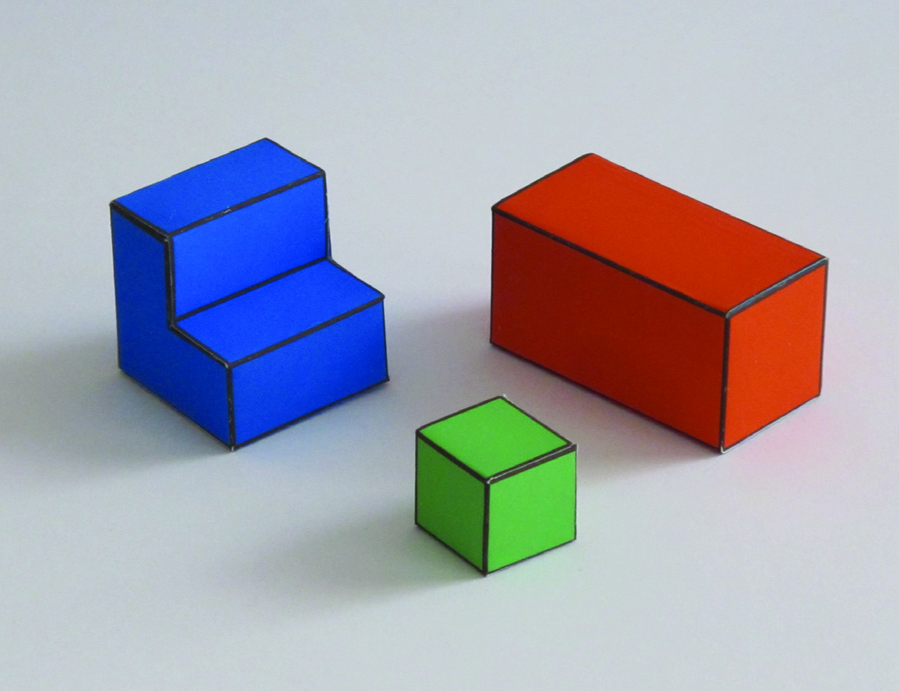
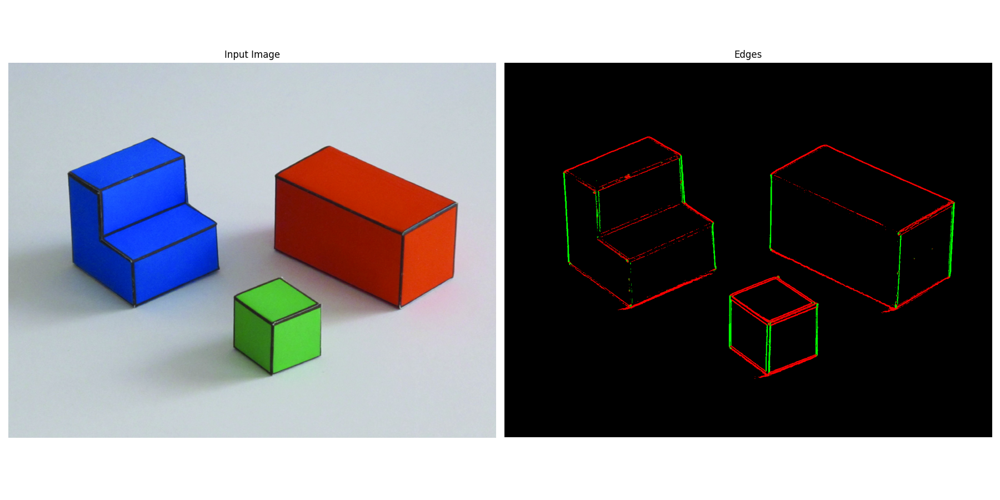
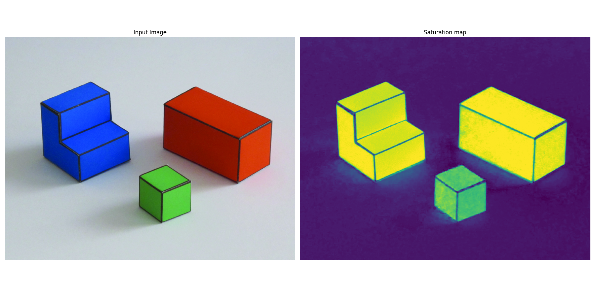
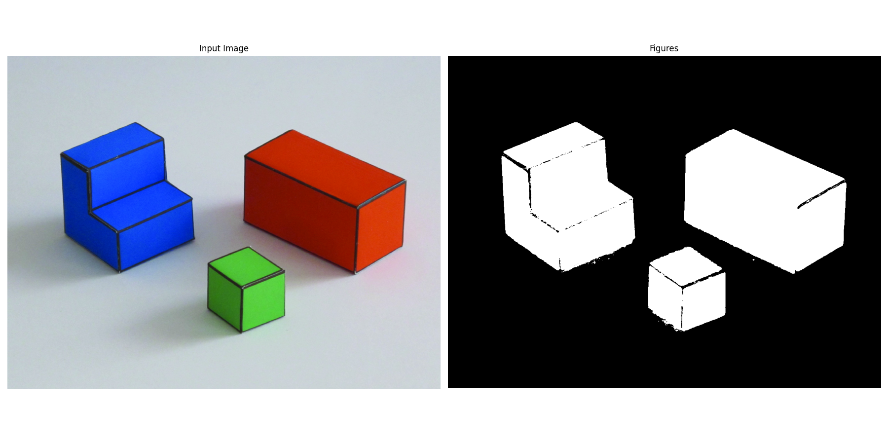

# Simple Vision System

## Project Overview

**Simple Vision System** is an educational project aimed at building a basic computer vision pipeline that can reconstruct a simple 3D scene (the "cubic world") from a single 2D image. The project demonstrates fundamental concepts in image processing, edge detection, and scene interpretation.

## Goal

The final goal is to create a system that, given a 2D picture of a simple cubic scene, can automatically infer and reconstruct the corresponding 3D structure.

## Example Input

Below is an example of a 2D input image used by the system:

## Example Outputs

**Edge Detection:**

**Saturation Map:**

**Gradient Norm:**

**Figures/3D Interpretation:**

## Features

- Edge detection and classification (vertical/horizontal)
- Ground/background segmentation
- 3D point cloud generation from 2D image
- Visualization of intermediate and final results

## Status

**Work in progress!** The project is currently under development. Features and results may change as the system evolves.

## How to Use

1. Clone the repository.
2. Install dependencies (see `pyproject.toml`).
3. Run the main pipeline on an example image.
4. Explore the outputs in the `example_images` directory.

## Educational Value

This project is designed for learning and experimentation.

## TODO

- Image blurring / Gaussian gradients
- Base plane estimation
- Border classification enhancement
